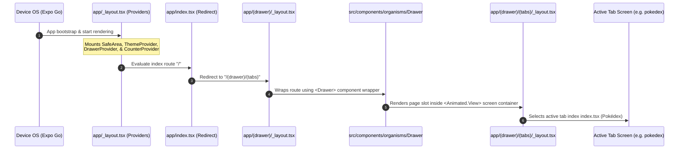
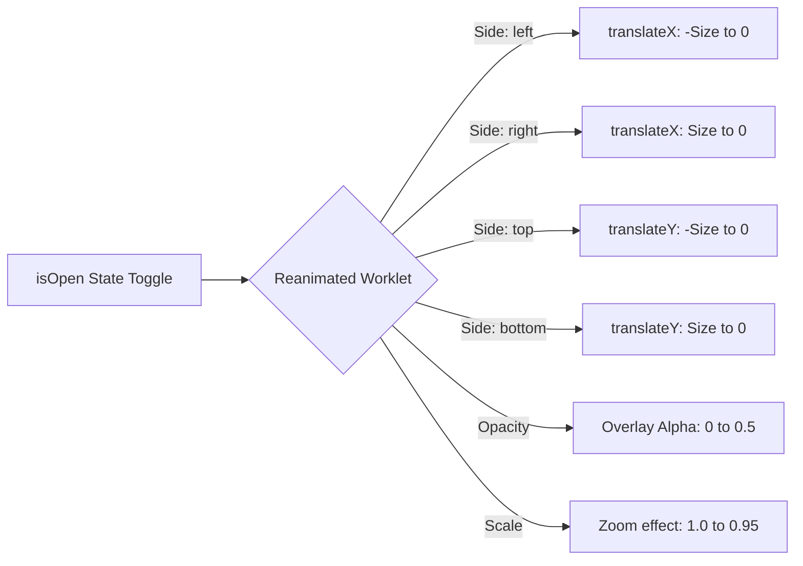
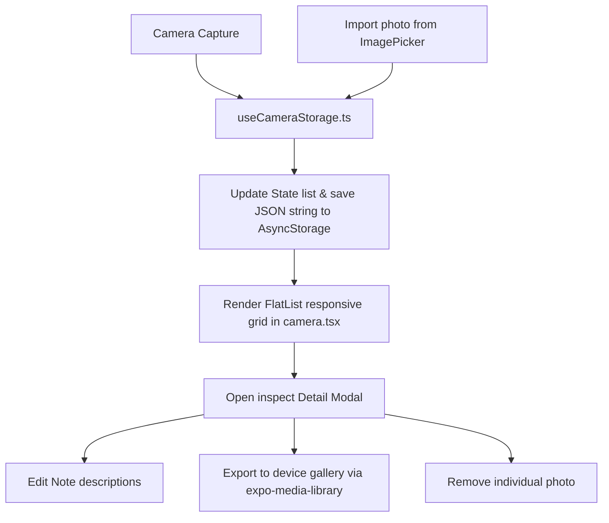

# MyDrawerApp Developer & Educator Workspace Guide

Welcome to the **MyDrawerApp** internship codebase. This guide serves as a comprehensive educational document to explain the project architecture, directory organization, logic execution workflow, and native API interactions.

---

## 1. Project Directory Architecture

The application is structured using **Atomic Design Principles** paired with a **Feature-Driven Architecture** to keep visual elements decoupled from business logic:

```
MyDrawerApp/
├── app/                        # Expo Router File-Based Routing Shell
│   ├── (drawer)/               # Drawer Screen Shell
│   │   ├── (tabs)/             # Nested Bottom Tabs Structure
│   │   │   ├── _layout.tsx     # Tab configuration and Ionicons icons
│   │   │   ├── camera.tsx      # Native Camera Gallery screen
│   │   │   ├── counter.tsx     # State Manager Counter screen
│   │   │   ├── index.tsx       # Pokédex search index view
│   │   │   └── profile.tsx     # User profile snapshot preview
│   │   ├── _layout.tsx         # Mounts SlidingDrawer on top of routes
│   │   └── settings.tsx        # Pradesh Location List settings
│   ├── _layout.tsx             # Root file: Mounts all React Context Providers
│   └── index.tsx               # Redirects root '/' entry to tabs
│
├── src/                        # Core Application Source Code
│   ├── components/             # Reusable Atomic UI Components
│   │   ├── atoms/              # Simple UI elements (Button, GlassCard)
│   │   ├── molecules/          # Combined atoms (ThemeSwitch)
│   │   └── organisms/          # High-level layouts (Header, Drawer)
│   │
│   ├── context/                # App-wide global states (ThemeContext)
│   │
│   ├── features/               # Decoupled Feature Modules
│   │   ├── camera/             # Camera state, storage, and assets logic
│   │   ├── counter/            # Counter business state contexts
│   │   └── navigation/         # Sliding drawer context state handlers
│   │
│   ├── styles/                 # Theme tokens (colors, spacing, typography)
│   ├── types/                  # Global shared typescript interfaces
│   └── utils/                  # Utility functions (logger wrappers)
```

---

## 2. Global Execution Workflow (Step-by-Step)

Here is how the application executes from initial boot to rendering a fully animated interactive page:



### Execution Steps
1. **Bootstrap Stage (`app/_layout.tsx`)**:
   When the app mounts, it boots the root layout wrapper. It imports and wraps the entire application with state management providers:
   - `SafeAreaProvider`: Manages notch, header, and system menu padding limits.
   - `ThemeProvider`: Supplies light/dark color mappings to theme-aware elements.
   - `DrawerProvider`: Stores drawer state variables (`isOpen`, `side` / `position`).
   - `CounterProvider`: Houses application state for the counter features.

2. **Redirect Stage (`app/index.tsx`)**:
   As there is no dashboard on root `/`, this component executes a `<Redirect href="/(drawer)/(tabs)" />` to send users directly into the drawer tab shell.

3. **Drawer Shell Stage (`app/(drawer)/_layout.tsx`)**:
   The drawer layout wraps all nested pages using the custom `<SlidingDrawer>` component, which pulls the open/close state from the `DrawerProvider` context and passes it directly to our core `Drawer` layout container.

4. **Tab Shell Stage (`app/(drawer)/(tabs)/_layout.tsx`)**:
   Configures the bottom tab bar navigation buttons (Pokédex, Counter, Camera, Profile) with vector icons.

---

## 3. Interactive Drawer Component Mechanics

The **Drawer Component** handles 4-way animations (`left`, `right`, `top`, `bottom`) and responsiveness:



### Layout Properties
- **Spring Physics (`withSpring`)**: High-performance UI rendering running at 60 FPS directly on the native rendering threads, avoiding JavaScript bridge delay.
- **Dynamic Adaptability**: The component uses `useWindowDimensions()` to recalculate drawer widths and heights on screen orientation switches or web browser resizing.
- **Accessibility Control**: Includes voice navigation attributes (`accessibilityViewIsModal`, `importantForAccessibility`) and registers a hardware back listener on Android platforms to dismiss the drawer cleanly instead of exiting the application.

---

## 4. Multi-Photo Camera & Storage Feature

The Camera module has been redesigned to support a full grid photo gallery view with dynamic photo notes, imports, individual gallery exports, and sweeping clears.



### Logic Workflows

#### **A. Image Intake Pipeline (Capture & Import)**
1. The user triggers **Take Snapshot** (opening the camera viewfinder overlay) or **Import Photo** (triggering Expo `ImagePicker` to let users choose an image from their device camera roll).
2. Once the image path is returned, a new `CapturedPhoto` data structure is constructed:
   ```typescript
   interface CapturedPhoto {
     id: string;        // Unique timestamp hash ID
     uri: string;       // File path pointing to device caches
     timestamp: string; // Structured local date and time string
     notes?: string;    // Custom user text notes
   }
   ```
3. The new photo is added to the top of the state array, and the updated list is stringified into JSON and persisted to the local flash storage database using `AsyncStorage`.

#### **B. Local Rehydration Pipeline**
1. On app boot, a `useEffect` inside `useCameraStorage.ts` queries `AsyncStorage` for the key `@captured_photo_list`.
2. If photos are found, the JSON string is parsed back into a typescript array, updating the gallery state and instantly showing your photo cards on the dashboard dashboard grid.

#### **C. File Actions & Gallery Exports**
- **Delete Single**: Filter out the photo ID from the list, update state, and save changes back to AsyncStorage.
- **Edit Notes**: Allow users to type custom titles/notes directly into a text field in the modal. This metadata is saved alongside the photo object.
- **Replace**: Triggers the `ImagePicker` dialog, allowing users to choose another picture to swap with the current selected slot while retaining the note history and timestamp.
- **Export to Gallery**: Leverages `expo-media-library` to save cached photos directly to the system gallery album.

---

## 5. Development Command Registry

Execute these terminal commands at the project root to manage your workflow:

| Command | Action |
| :--- | :--- |
| `npm run start` | Boots the Expo CLI bundler engine |
| `npm run android` | Boots emulator and runs Android application |
| `npm run ios` | Boots simulator and runs iOS application |
| `npm run web` | Launches local web dev server in your web browser |
| `npm run lint` | Inspects codebase styles and raises warning/errors |
| `npx tsc --noEmit` | Performs typing audits on all typescript modules |
