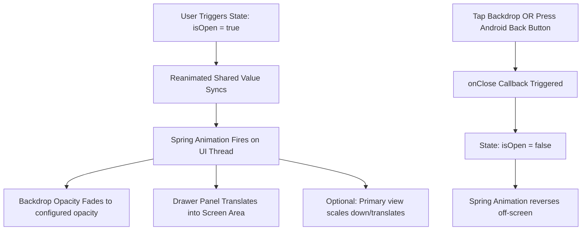

# Responsive Animated Multi-Position Drawer Component

A premium, highly performant, fully responsive, and accessible side panel/drawer component designed for React Native and Expo applications. Built using `react-native-reanimated` for layout transitions and vanilla React Native style sheets.

---

## Table of Contents
- [Purpose & Features](#purpose--features)
- [Folder Structure](#folder-structure)
- [Props Interface](#props-interface)
- [Usage Examples](#usage-examples)
- [Workflow & State Management](#workflow--state-management)
- [Responsive Behavior](#responsive-behavior)
- [Accessibility (ARIA) & Focus Control](#accessibility-aria--focus-control)
- [Higher-Order Component (HOC) Example](#higher-order-component-hoc-example)

---

## Purpose & Features

The primary objective of this component is to provide a unified drawer panel system that works consistently across multiple screen form-factors (Mobile, Tablet, and Desktop/Web) and supports dynamic placements (`left`, `right`, `top`, `bottom`).

### Key Features
1. **Dynamic Placement**: Slide the panel from `left`, `right`, `top`, or `bottom` boundaries out-of-the-box.
2. **60 FPS Animated Transitions**: Utilizes Reanimated's worklets to run layout animations directly on the UI thread, bypassing JavaScript bridge congestion.
3. **Adaptive Responsiveness**: Uses `useWindowDimensions()` to compute appropriate widths/heights dynamically depending on screen size.
4. **Overlay Zoom Effects**: Includes an optional screen zoom/scale effect (`enableZoomEffect`) that mimics high-end mobile operating system transitions.
5. **Full Accessibility**: Uses standard screen reader parameters (`accessibilityViewIsModal`, `accessibilityRole`, and focus hiding tags) and manages the hardware back buttons on Android platforms.

---

## Folder Structure

The component follows a clean, self-contained architecture layout inside your project's components module:

```
src/components/organisms/Drawer/
├── index.ts               # Public component and HOC entry point exports
├── Drawer.tsx             # Primary component logic and lifecycle hooks
├── withDrawer.tsx         # Higher-Order Component (HOC) extension
└── styles/
    └── styles.tsx         # Layout StyleSheet definitions
```

---

## Props Interface

```typescript
export type DrawerPosition = 'top' | 'bottom' | 'left' | 'right';

export interface DrawerProps {
  /**
   * Visibility state of the drawer panel.
   */
  isOpen: boolean;

  /**
   * Callback function triggered when the drawer is requested to close
   * (e.g. through clicking the backdrop overlay or pressing the Android hardware back button).
   */
  onClose: () => void;

  /**
   * Placement position of the drawer.
   * @default 'left'
   */
  position?: DrawerPosition;

  /**
   * Custom width of the drawer (applicable for 'left' and 'right' positions).
   * If not provided, it falls back to a responsive, screen-width-dependent value.
   */
  width?: number | string;

  /**
   * Custom height of the drawer (applicable for 'top' and 'bottom' positions).
   * If not provided, it falls back to a responsive, screen-height-dependent value.
   */
  height?: number | string;

  /**
   * Render function or node for the content inside the drawer panel.
   */
  renderContent: () => React.ReactNode;

  /**
   * Children components representing the primary screen content.
   * If provided, the drawer wraps these components and applies backdrop/zoom effects.
   */
  children?: React.ReactNode;

  /**
   * Background color of the backdrop overlay.
   * @default '#000000' (opacity is managed via backdropOpacity)
   */
  backdropColor?: string;

  /**
   * Maximum opacity of the backdrop overlay when the drawer is fully open.
   * @default 0.5
   */
  backdropOpacity?: number;

  /**
   * Enables the 3D-like zoom & scale translation effect on the main screen content.
   * @default false
   */
  enableZoomEffect?: boolean;

  /**
   * Accessibility label for screen reader users on the drawer wrapper.
   * @default 'Navigation Drawer'
   */
  accessibilityLabel?: string;

  /**
   * Custom styles applied to the drawer panel.
   */
  style?: StyleProp<ViewStyle>;
}
```

---

## Usage Examples

Below are standard examples demonstrating how to use the `Drawer` component programmatically.

### 1. Basic Left Drawer (Standard Overlay)

```tsx
import React, { useState } from 'react';
import { View, Text, Button } from 'react-native';
import { Drawer } from '@/components/organisms/Drawer';

export default function App() {
  const [isOpen, setIsOpen] = useState(false);

  return (
    <Drawer
      isOpen={isOpen}
      onClose={() => setIsOpen(false)}
      position="left"
      renderContent={() => (
        <View style={{ flex: 1, padding: 24, justifyContent: 'center' }}>
          <Text style={{ fontSize: 18, fontWeight: 'bold' }}>Left Menu Drawer</Text>
          <Button title="Close" onPress={() => setIsOpen(false)} />
        </View>
      )}
    >
      <View style={{ flex: 1, justifyContent: 'center', alignItems: 'center' }}>
        <Text>Main Screen Content Area</Text>
        <Button title="Open Left Drawer" onPress={() => setIsOpen(true)} />
      </View>
    </Drawer>
  );
}
```

### 2. Right Drawer (Custom Width & Color)

```tsx
<Drawer
  isOpen={isOpen}
  onClose={() => setIsOpen(false)}
  position="right"
  width={350}
  backdropColor="#2c3e50"
  backdropOpacity={0.7}
  renderContent={() => <SidebarPanel onClose={() => setIsOpen(false)} />}
>
  <MainScreen />
</Drawer>
```

### 3. Top Drawer (Notifications / Quick Settings)

```tsx
<Drawer
  isOpen={isOpen}
  onClose={() => setIsOpen(false)}
  position="top"
  height="40%" // percentage of screen height
  renderContent={() => <QuickSettingsPanel />}
>
  <MainScreen />
</Drawer>
```

### 4. Bottom Drawer (Action Sheet)

```tsx
<Drawer
  isOpen={isOpen}
  onClose={() => setIsOpen(false)}
  position="bottom"
  height={300} // fixed pixel size
  enableZoomEffect={true} // enables scale down animation of screen content
  renderContent={() => <ActionSheetOptions />}
>
  <MainScreen />
</Drawer>
```

---

## Workflow & State Management



1. **State Trigger**: The parent component holds the `isOpen` state.
2. **Animation Layer**: A Reanimated shared value synchronizes with this state and animates between `0` (closed) and `1` (open) using a damped spring.
3. **Axis-aligned Interpolations**: The coordinates shift the drawer out of bounds in its starting axis (e.g. `translateX = -width` for left position) and smoothly interpolates to `0` when active.
4. **Hardware Handlers**: A scoped event listener listens to Android's `hardwareBackPress` to toggle `onClose()` automatically if the drawer is visible, preventing system exit.

---

## Responsive Behavior

The component computes its layouts dynamically at runtime by consuming the `useWindowDimensions()` react hook. 
- **Web & Tablet (Width >= 768px)**: The drawer adjusts default width to `360px` or `400px` to avoid taking up the full screen, preserving aesthetics.
- **Mobile (Width < 768px)**: The drawer panel stretches to occupy `80%` of the device width (up to `300px` max), ensuring sufficient real estate for menus.
- **Orientation changes**: When the screen rotates, the width and position interpolations re-evaluate instantly, maintaining panel layout bounds.

---

## Accessibility (ARIA) & Focus Control

The drawer incorporates the following details to support assistive technologies:
- **`accessibilityViewIsModal={true}`**: Notifies the operating system's screen readers that the active layer is a modal, shifting context reading priority.
- **`importantForAccessibility`**: Set dynamically to `'yes'` (when open) or `'no-hide-descendants'` (when closed) to prevent disabled drawers from being indexed by screen readers.
- **Backdrop Buttons**: The overlay uses descriptive `accessibilityLabel` and `accessibilityHint` fields for easy voice control triggers.
